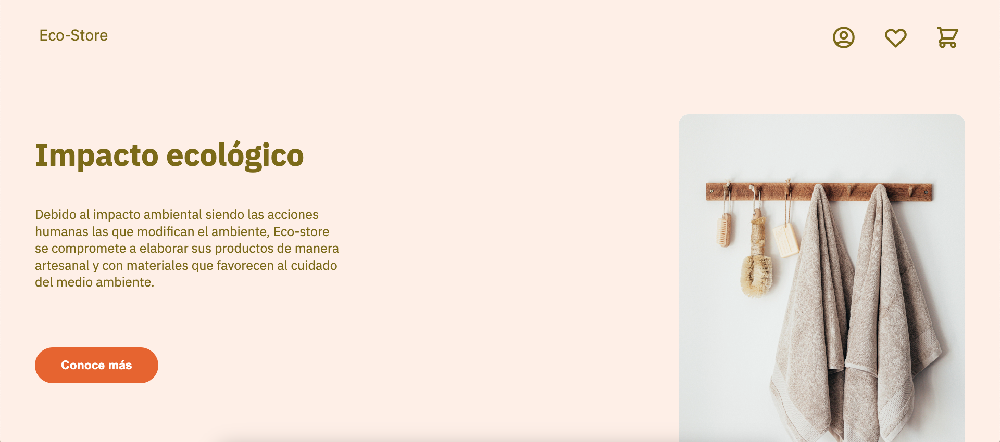

# Eco store

Proyecto del *Curso de Fundamentos de Sass: Crea tu primera landing page* en *Platzi*



## Desarrollo

Para trabajar y compilar los archivos Sass se hace uso de dos extensiones en VsCode

- Sass (Syler)
- Live Sass Compiler (Glenn Marks)

En la configuración de VsCode se debe agregar

```json
{
    "liveSassCompile.settings.formats": [
        {
            "format": "expanded",
            "extensionName": ".css",
            "savePath": "/css",
        }
    ]
}
```

Y para que quede escuchando los cambios y compile en cada guardado lo activamos con **`Cmd`** + **`Shift`** + **`P`**
y seleccionamos la opción *Live Sass: Watch Sass*

## Fuentes

- [Diseño del curso](https://www.figma.com/file/Em1aDiIHmqozHpUAjsYhT7/Eco-Store-Mockups-(Copy)?type=design&node-id=0-1&t=EIRQcKSqsZflHFZN-0)
- [Curso en Platzi](https://platzi.com/cursos/sass/)
